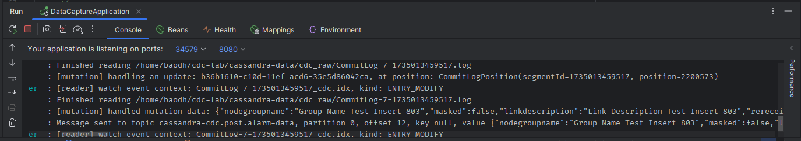
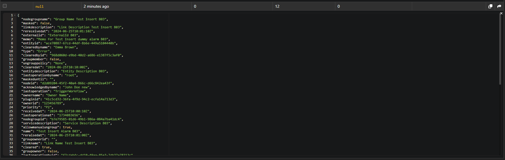
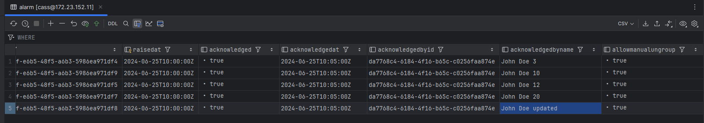
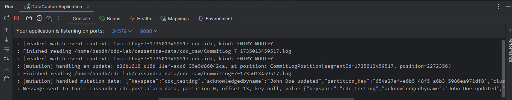
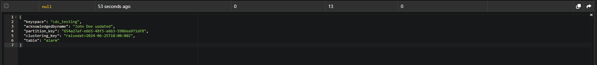

### Definition

- `DatabaseDescriptor` is central utility class that acs as a configuration handler.
    - It is responsible for initializing and managing configuration settings for the database, such as reading the
      configuration file (cassandra.yaml) and exposing these settings to other components.
- `Schema.instance` refers to the singleton instance of the Schema class, which is responsible for managing the schema
  metadata of the database.
    - It centralizes the definitions of keyspaces, tables, and their associated metadata, acting as the in-memory
      representation of the database schema.
- `PartitionUpdate`: 

----
### TODO
- Need to trigger Schema load a new keyspace & table while running.

---
### Testing
#### INSERT
1. Insert a new row into Alarm database

2. Handle insert mutation then publishing it into kafka topic

#### UPDATE
1. Update an exists Alarm row

2. Handle update mutation then publishing it into kafka topic

